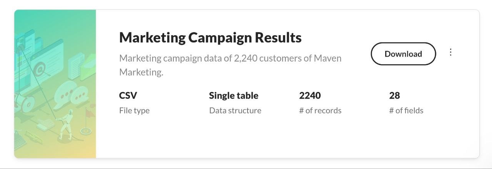
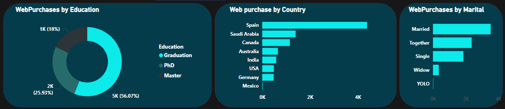
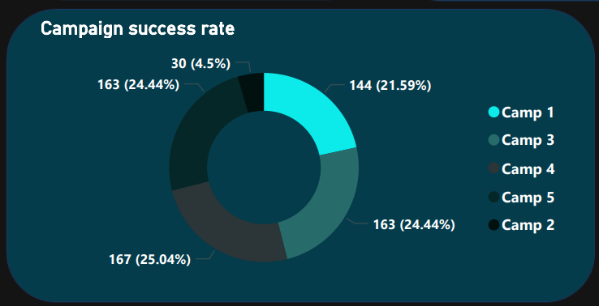
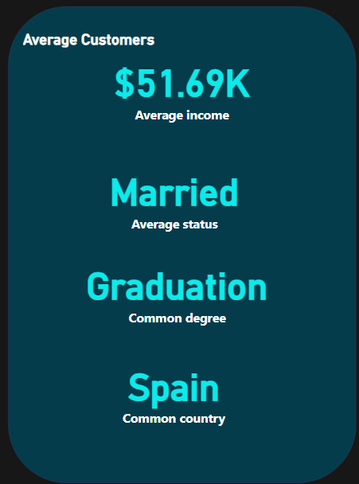
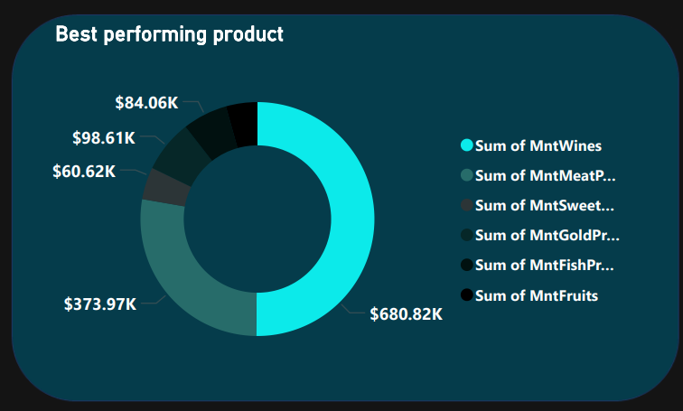
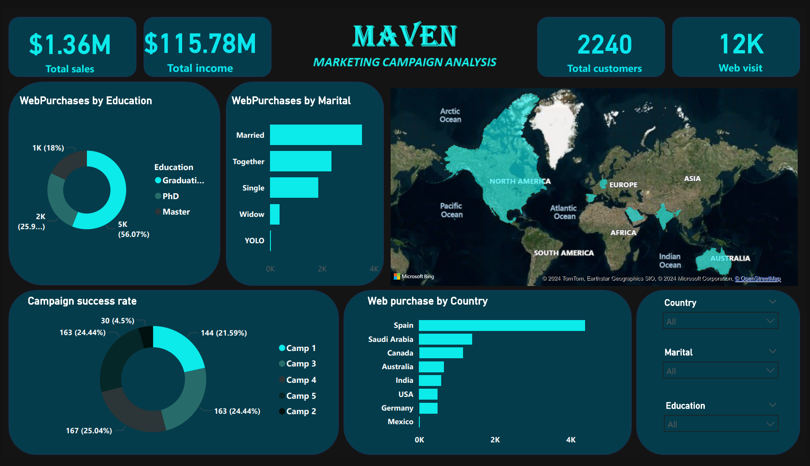
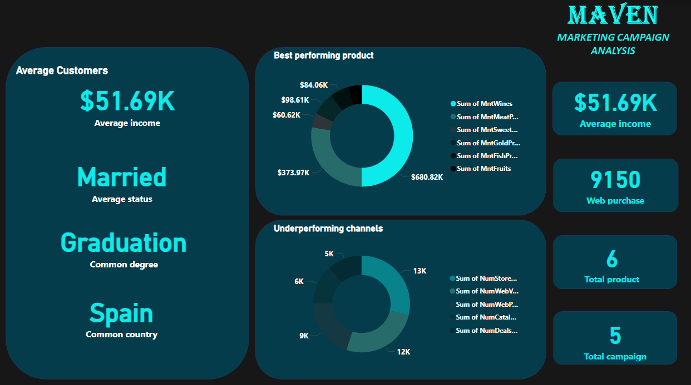

# Marketing Campaign Analysis

## Data Source

Dataset from **_Maven Analytics_**, was imported to power bi using the "**Get data**" option in the _Data Tab_, containing **2,240 rows and 28 columns**.

## Introduction
This project focuses on analyzing a dataset of 2,240 customers from Maven on **Marketing campaign** using Power BI. The dataset includes detailed customer profiles, product preferences, campaign outcomes (successes and failures), and channel performance. The goal is to uncover actionable insights to optimize marketing strategies, improve campaign effectiveness, and enhance customer engagement. Through Power BI's powerful visualization and analytical capabilities, the project provides a comprehensive understanding of the campaign's performance and customer behavior.

## Problem Statement
1.  Are there any null values or outliers? How will you handle them?
2.  What factors are significantly related to the number of web purchases?
3.  Which marketing campaign was the most successful?
4.  What does the average customer look like?
5.  Which products are performing best?
6.  which channel is underperforming?

## Concept Execution
The following Power Bi features were incoperated;
- Data sources, 
- Data cleaning, 
- Power Query,
- Data modeling,
- Caculated Columns and Measures using Dax,
- Data Visualization,
- Filters,
- Dashboard Building and
- Reporting.

## Data Cleaning
The "Remove Duplicates" operation was used on the "ID" column, confirming that no duplicates existed and null values were replaced to 0(zero), Column data types were appropriately validated, such as formatting the "Income" column to display currency. Additionally, the "Year_Birth" column was renamed to "Birth_Year" and was converted to the "Date" data type.

## Modeling
The automatic derived table relationships were adjusted, making the date column power bi working date for the analysis.

## Data Discovery
1.  Are there any null values or outliers? How will you handle them?
Yes. i found null values in the "income" column, which i used find and replace operation to change them to 0, they seem to be unemployed and independent.

2.  What factors are significantly related to the number of web purchases?

From the first donut chart, we can see that the highest number of buyers have Graduation, followed by PhD and Masters, which indicates **Large population**, there are typically more individuals with a graduation-level education compared to those with advance degree and could indicate **Targeted Marketing** marketing campaign might be more tailored to appealto graduates, aligning with their preferences. 
The middle bar chart indicates that people from Spain have the highest tendency to buy through the web.
The last bar chart shows that married people purchase the most from the web channel which is probably due to **convenience**, balancing work and family responsibilities, purchasing online is more convenient and time saving compared to visiting physical stores.

3. Which marketing campaign was the most successful?

The chart shows that campaign 4 have the most successful marketing campaign on 25.04%

5. What does the average customer look like?

An average customer has around;
- $51.69k USD income,
- Has a graduation degree,
- Probably married and
- Probably from Spain.

i created the following measures using these DAX formulas;

`Average income = AVERAGE(marketing_data[Income])`

`Average status = TOPN(1, VALUES(marketing_data[Marital_Status]), CALCULATE(COUNT(marketing_data[Marital_Status])), DESC)`

`Common country = TOPN(1, VALUES(marketing_data[Country]), CALCULATE(COUNT(marketing_data[Country])), DESC)`

`Common degree = TOPN(1, VALUES(marketing_data[Education]), CALCULATE(COUNT(marketing_data[Education])), DESC)`

5. Which products are performing best?

From the donut chart, we can see that **Wine** sales are performing the best and followed by meat.

6. which channel is underperforming?

From the chart we can see that the deals purchase and catelog channels are underperforming.

## Visualization
The report comprises of 2 pages; 
- Overview

- Average customer profile.

This dashboard provides an in-depth analysis of a marketing campaign’s performance, customer demographics, purchasing power and campaign effectiveness.
key Values;
- Total Sales: $1.36M
- Total Income: $115.78M
- Total Customers: 2,240
- Web Visits: 12,000
- Web Purchases: 9,150
- Total Products: 6
- Total Campaigns: 5

## Conclusion
The dashboard highlights the strengths in product sales (especially wine), the high engagement of married customers, those with higher education, and Spain’s dominance in web purchases. However, some channels and campaigns show underperformance, indicating areas for potential marketing optimization.

## Recommendations:
1: Increase Product Promotion: Focus more on popular items like wine and explore why certain products lag.
2: Target lagging Marketing Channels and geographic locations: Improve the underperforming channels by understanding the factors contributing to low engagement and Leverage the success in Spain to expand similar strategies to other high-performing countries.

